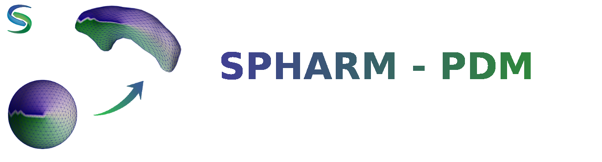

Shape analysis has become of increasing interest to the medical community due to its potential to precisely locate morphological changes between healthy and pathological structures. SPHARM-PDM is a tool that computes point-based models using a parametric boundary description for the computing of Shape analysis.

The point-based models computed with the SPHARM-PDM tool can be used in combination with the also UNC designed statistical tool shapeAnalysisMANCOVA to perform quantitative morphological assessment of structural changes at specific locations.

SPHARM-PDM is now available as a 3D Slicer extension (http://www.slicer.org) and as a SlicerSALT module (https://bpaniagua.github.io/slicersalt.github.io/)

Prerequisites
-------------
On 3D Slicer and SlicerSALT, Shape Analysis Module uses: 
* Shape Population Viewer extension which displays the outputs generated by Shape Analysis Module. 
	- To install Shape Population Viewer on 3D Slicer, follow these instructions: 
		1. Download Shape Population Viewer executable on [NITRC](https://www.nitrc.org/projects/shapepopviewer/)
		2. In 3D Slicer, add the folder where Shape Population Viewer executable is stored at _Edit/Application Settings/Modules/Add_ (https://www.slicer.org/wiki/File:ModulesSettings.png)
		3. Restart 3D Slicer
* Mesh To Label Map, which will be downloaded automatically with Shape Analysis Module (https://www.slicer.org/wiki/Documentation/Nightly/Extensions/MeshToLabelMap)

License
-------------
See License.txt

More information
-------------
Find the tool on [NITRC](http://www.nitrc.org/projects/spharm-pdm/)

